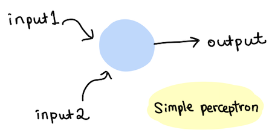
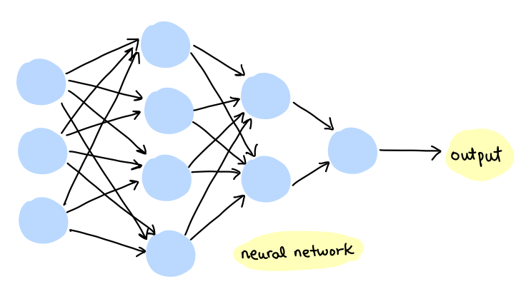
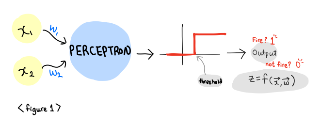
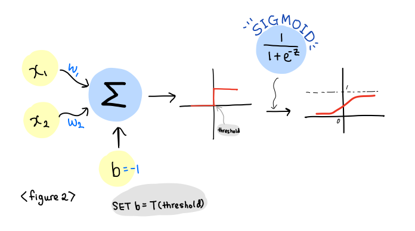

# Demystifying Neural Network

- Simple Perceptron
- Perceptron, a decision maker
- We need a Performance Function
- Add a threshold to Perceptron, Make our Lives Easier
- Here comes our Friend, Sigmoid Function


When I first heard about neural network, I won't lie. I was scared! The name 'neural network' also came from the fact that neural network behaves in a similar fashion to biological neurons.

The word 'neural' itself seems awfully complicated (not that I almost failed Intro to Neuroscience class in college), yet it's combined with the word 'network'. Gosh. I am studying deep learning with awesome sources: *the Nature of Code* by Daniel Shiffman and *Neural Network with Deep Learning* by Michael Nielsen, and a MIT course on Artificial Intelligence taught by Professor Patrick Winston.

In order to not get overwhelmed and frustrated by information overload, I decided to start writing short blog posts. These are intended to record my learning journey. By implementing codes in the books, summarizing and writing what I learned in my own language, I intend to grasp key concepts of deep learning. Without further ado, let's start by first talking about the basic structure of perceptron.

#### Simple Perceptron
In order to understand Neural Network, we first have to understand perceptron. Why? Because neural network is also called as a multilayer perceptron; a perceptron is a single neuron model, and a neural network is a "network of perceptrons" (often, 500,000 neurons). A perceptron takes one or more binary inputs and gives a simple binary output.




A perceptron is a feed-forward model. Inputs get weighted as they flow in, and the weighted inputs are summed. Weights represent the importance of the respective inputs to the outputs. Then, the weighted sum goes through an activation function. This process of perceptron's receiving inputs and generating an output is called feed-forward. As the perceptron has a binary output, the activation tells the perceptron to "fire" or not. Below figure shows a simple perceptron's feed-forward process.



#### Perceptron, a decision maker
Here's a simple example. Let's say there is a weekday wine tasting event at one of your favorite restaurants. There are multiple factors that affect your decision. Let's consider 3 factors and call them $x_1$, $x_2$, $x_3$.

1. Is the restaurant not far from your work?
2. Is your significant other interested in going?
3. Is wine/cheese selection impressive? (very important factor for me!)

If the restaurant is far from your work, $x_1$ has a value of 0. If your significant other is excited to go with you, then $x_2$ is 1. If the restaurant provides excellent wine/cheese selection, then $x_3$ is 1. Then these inputs are multiplied by the corresponding weights. Who wants to drive for an hour to the restaurant after tiring day at work? So I will choose a weight $w_1$ = 4. I still can enjoy wine tasting without my boyfriend (well, it will be less fun, but I mean wine and cheese. Who needs more?) So, I will choose a weight $w_2$ = 2. For $x_3$, if the selection is impressive, I will not miss it for sure. A weight $w_3$ = 5.

This perceptron can serve as a decision making process. Now if we add up all $x$ values with the respective $w$ values, I would know whether I should go to the wine tasting event or not. Inputs, weights, and bias have a cumulative influence on output. By varying weights and thresholds, we end up with different decisions calculated by our perceptron.

#### We need a Performance Function
Neural network is a function approximator. There should be a way to compare the true value with the predicted value generated by perceptron. We need a performance function to measure how well a perceptron is doing. For now, how about this?
$$Performance =\Vert{predicted - true}\Vert$$
This measures magnitude of the distance between two values. However, this turns out to be mathematically inconvenient.

Instead of just taking the absolute value of the difference, we square it.
$$Performance =-\frac{1}{2}(predicted - true)^{2}$$
(Does this function look familiar to you? It should be! This is **Mean Squared Error** that we use as a lost function for linear regression problems). When we train a neural network, we adjust weights and thresholds so that the network gives us the right answer. Thus, we take partial derivatives of above performance function with respect to weights and biases $(\dfrac{\partial P}{\partial w_1}$, $\dfrac{\partial f}{\partial w_2}$, $\dfrac{\partial f}{\partial b})$. This helps us to measure how much improvements we get by changing weights and biases a little.

#### Add a threshold to Perceptron, Make our Lives Easier
For a notational convenience, mathematicians came up with the so called "bias trick" of adding a bias term to a perceptron. Then, our weighted sum can be written as:
$$ a = \sum_{i=1}^3 w_i x_i + b = w^T x + b$$
And our activation function can be written as:
$$z = h(a) = h \left( w^Tx + b \right)$$

#### Here comes our friend sigmoid function


In order to use gradient descent, we need a continuous function. However, perceptron only gives us a simple binary output; it's a step function. We cannot use gradient descent on discontinuous function. Its derivatives are equal to 0 everywhere (at 0, it's not differentiable). Thus, we implement a sigmoid function, which will convert this step function into a continuous function.
$$h(a) = \sigma(a) = \frac{1}{1+e^{-a}}$$
It looks very different from a perceptron model that we have seen up till now, but this sigmoid perceptron behaves very much alike to our plain perceptron. If $a$ is extremely big, then $e^{-a}$ is extremely negative, and $h(a)$ becomes 1. On the other hand, if $a$ is extremely negative, then $e^{-a}$ is extremely positive, and $h(a)$ goes to 0 asymptotically.

Furthermore, sigmoid function gives a very clean derivative.
$$\frac{d\sigma(a)}{da} = \sigma(a)(1-\sigma(a)) = \sigma(a)\sigma(-a)$$
So clean and easy, right?

With sigmoid activation function, we can take partial derivatives of performance function with respect to weights that we have. Here, greek letter eta $(\eta)$ represents step size (also called learning rate) sets a step size we take when following gradients. This tells us how much change in improvement we get when weights move a little. This can be written as follows:

$$\Delta w = \eta(\dfrac{\partial P}{\partial w_1}i +\dfrac{\partial P}{\partial w_2}j)$$


Here is a code for a simple perceptron implementation.

```python
import random, math

class Trainer:
    """
    trainer object stores the inputs and the correct answer
    """
    def __init__(self, x1, x2, answer):
        self.inputs = []
        self.inputs.append(x1)
        self.inputs.append(x2)
        self.inputs.append(1) # bias input built into its array
        self.answer = answer

class Perceptron:
    def __init__(self, input_num, lr):
        """
        create perceptron
        arguments:
        input_num: the number of inputs (i.e, 2 inputs and 1 bias = 3)
        """
        self.weights = [random.uniform(-1,1) for i in range(0,input_num)]
        self.lr = lr

    def feedforward(self, inputs):
        self.sum = 0
        for i in range(0,len(inputs)-1):
            self.sum += inputs[i] * self.weights[i]
        return self.__activate()

    def __activate(self):
        """
        the activation function
        """
        if self.sum >= 0:
            return 1
        else:
            return -1

    def train(self, inputs, target):
        """
        tune all the weights
        """
        guess = self.feedforward(inputs)
        error = target - guess

        for i in range(0, len(self.weights)-1):
            self.weights[i] += self.lr * error * inputs[i]

```

Next up: Training Neural Network
